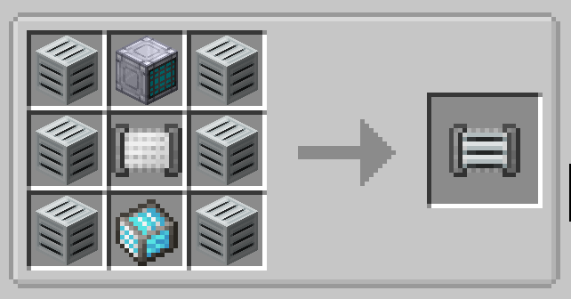
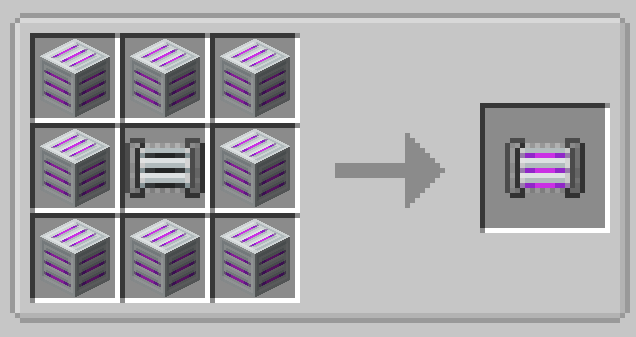

# Cleanroom Covers (GTCEu Modern addon)

 
---

## About

A 1.20.1 [GregTech: CEu Modern](https://www.curseforge.com/minecraft/mc-mods/gregtechceu-modern) addon that adds two covers for granting cleanroom access to single-block machines.

See [Releases](https://github.com/Cyber1551/Cleanroom-Covers/releases) for the compiled jars.

## Features

Introduces two covers that grant a **single-block machine** cleanroom access...no multiblock cleanroom required.

|                                                                        | Cover                        | Grants              |
|------------------------------------------------------------------------|------------------------------|---------------------|
|          | **Cleanroom Cover**          | `CLEANROOM`         |
|  |  **Sterile Cleanroom Cover** | `STERILE_CLEANROOM` |

- **Single-block only:** covers can't be attached to multiblock controllers or parts.
- **One per machine:** a machine accepts a single cleanroom cover; attaching a second is blocked on every face.
- **Stacks with real cleanrooms:** if the machine is also inside an actual cleanroom, *both* the room's type and the cover's type apply (e.g. a machine in a regular cleanroom with a Sterile cover satisfies recipes needing `CLEANROOM` **and** `STERILE_CLEANROOM`).

## Usage

Hold a cover and right-click the face of a single-block machine to attach it. The machine immediately counts as being in a cleanroom of the cover's type for recipe purposes. Remove it with a crowbar like any other cover.

## Recipe

### Cleanroom Cover

### Sterile Cleanroom Cover

## Requirements

- Minecraft **1.20.1** (Forge)
- [GregTech CEu Modern](https://www.curseforge.com/minecraft/mc-mods/gregtechceu-modern)

## License

Licensed under [LGPL-3.0](LICENSE), matching GregTech CEu Modern.
